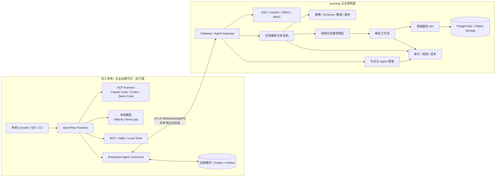
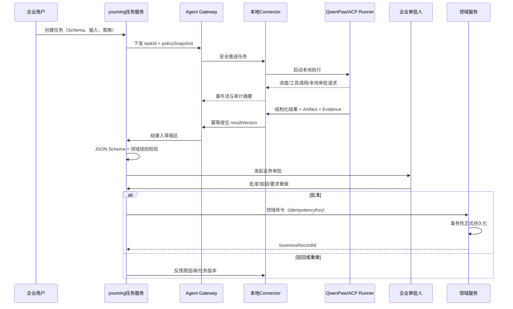

# 基于 QwenPaw 与 youming 的企业级智能体平台可行性报告

> 文档性质：AI 辅助评估草稿，待架构、产品、安全、法务共同评审后归档。<br>
> 评估日期：2026-07-10<br>
> 评估对象：QwenPaw fork（本机 `../open-longma`）+ 企业后台（当前仓库 `youming`）<br>
> 建议目标：以本地智能体执行为主，企业服务协同、结构化结果提交、业务审批确认和中心化持久化为闭环。

---

## 1. 执行摘要

### 1.1 结论

**总体可行，建议立项，但不能把当前 QwenPaw 直接当作“企业级平台成品”。**

推荐采用以下定位，而不是把 QwenPaw 强行改造成中心化、多租户的企业后台：

- **QwenPaw / open-longma：本地智能体执行面（Local Execution Plane）**
  - 负责本地工作区、模型调用、Skills、MCP、ACP、Claude Code/Codex/Qwen Code 等外部 Agent 调度、本地文件与命令执行、执行期人工授权。
- **youming：企业控制面（Enterprise Control Plane）**
  - 负责企业用户与组织、SSO、RBAC/ABAC、多租户、节点注册、智能体模板、任务编排、业务审批、结构化数据校验、正式持久化、审计、运营和合规。
- **新增 Agent Connector / Agent Gateway：双向连接层**
  - 本地 Connector 主动连接中心服务，完成设备身份、任务下发、事件回传、结构化结果提交、断线续传、版本治理和策略同步。

核心原则是：

> **智能体可以生成“建议、草稿和结构化候选结果”，但不得直接写入企业核心业务表。正式数据必须经过服务端确定性校验、权限判断和审批后，由企业后台事务性持久化。**

### 1.2 可行性评分

| 维度 | 评分 | 结论 |
|---|---:|---|
| 产品方向 | 8/10 | “本地执行 + 企业治理 + 人工审批”有明确差异化和企业价值 |
| QwenPaw 能力复用 | 8/10 | 已有多 Agent、Workspace、Skills、MCP、ACP、审批卡片、安全治理等基础 |
| youming 后台复用 | 7/10 | 已具备 OAuth2、用户、部门、角色、菜单、权限、日志、PostgreSQL/Flyway 等基础 |
| 当前企业就绪度 | 3/10 | QwenPaw 当前仍是个人/单用户产品；youming 开源版明确缺少工作流、多租户、数据权限 |
| 安全与合规就绪度 | 3/10 | 当前本地认证、插件隔离、网络隔离、资源限制均不足以直接满足企业生产要求 |
| 工程实施风险 | 中高 | 难点不在“对话”，而在身份、协议、状态机、审批、幂等、安全和可运维性 |
| 综合建议 | **有条件立项** | 先做 4～6 周闭环 PoC，通过门禁后再进入 MVP |

### 1.3 最重要的架构判断

1. **不要复制一个新的聊天平台。** 产品核心应是“企业任务执行与受控落库”，聊天只是入口之一。
2. **不要直接让企业后台调用本地 QwenPaw 的内部 HTTP API。** 应增加稳定、版本化的 Connector 协议，隔离上游变化。
3. **不要让本地节点暴露公网入站端口。** 由 Connector 主动建立 mTLS WebSocket/gRPC 长连接，必要时降级为长轮询。
4. **不要混淆两种审批：**
   - 本地执行审批：是否允许读文件、执行命令、调用工具、访问某服务；
   - 企业业务审批：结构化结果是否可成为正式业务数据。
5. **不要把“Claude Code 在本机运行”误认为“模型完全本地”。** Claude Code/Codex 一类通常是本地 Agent 进程，但模型推理和遥测是否离开本机取决于供应商、部署方式和企业配置；真正离线需要 Ollama/llama.cpp 等本地模型路径。

---

## 2. 评估边界与仓库事实

### 2.1 仓库边界澄清

当前工作区 `/home/chdq/chdq/src/github/changdongqing/youming` **不是 QwenPaw fork**，而是基于 pig/pig-ui 二次开发的 Java/Vue 企业后台。QwenPaw fork 位于相邻目录 `../open-longma`。

因此，本报告把两者视为两个可以组合的产品面：

| 仓库 | 建议角色 | 当前技术栈 |
|---|---|---|
| `../open-longma` | 本地智能体执行端 | Python 3.11～3.13、FastAPI、AgentScope、React Console、ACP/MCP |
| `youming` | 企业控制台与业务服务端 | Java 17、Spring Boot/Cloud、OAuth2、Vue 3、PostgreSQL、Redis、Nacos |

如果最终希望形成单一产品，仍建议保持**双仓或清晰子项目边界**，通过版本化协议集成，而非将 Python Agent Runtime 直接嵌入 Java 服务进程。

### 2.2 QwenPaw 当前能力证据

本机 fork 在 2026-07-10 的版本声明为 `2.0.0b6`，当前提交为 `004026ece268f4cbd87bcfa90210f9db9ed03b09`。官方 PyPI 同期稳定版仍显示为 `1.1.12.post3`，说明本机 fork 跟随的是快速演进中的主线/Beta 代码，生产落地必须建立版本冻结与回归机制。

可直接复用的基础包括：

- 单次安装托管多个智能体，每个智能体有独立 Workspace；
- AgentScope ReAct 循环、会话、流式事件和工具调用层；
- Skills、MCP、插件、Cron、Memory、多渠道接入；
- 工具守卫、文件防护、沙箱、技能扫描和访问策略；
- `allow / deny / ask` 工具访问决策与本地审批卡片；
- ACP 双向集成：
  - QwenPaw 作为 ACP Client/Orchestrator 调度外部 Agent；
  - QwenPaw 作为 ACP Server 被 IDE 或外部客户端调用；
- 当前源码已内置 `opencode`、`qwen_code`、`claude_code`、`codex` 等 ACP runner 示例；
- 插件可注册 Provider、Tool、Hook、Middleware、HTTP Router 和频道。

主要本地证据：

- `../open-longma/website/public/docs/architecture.zh.md`
- `../open-longma/website/public/docs/acp-integration.zh.md`
- `../open-longma/website/public/docs/security.zh.md`
- `../open-longma/website/public/docs/plugins.zh.md`
- `../open-longma/src/qwenpaw/app/auth.py`
- `../open-longma/src/qwenpaw/__version__.py`

### 2.3 QwenPaw 当前企业化缺口

QwenPaw 的现有认证不能直接承担企业 IAM：

- Web 认证默认关闭；
- 源码明确说明为**单用户设计**；
- 密码使用加盐 SHA-256，而非企业常用的 Argon2id/bcrypt/scrypt；
- 本地 `127.0.0.1` / `::1` 请求自动免认证；
- 浏览器令牌存储在 localStorage；
- 存在超长期“永久令牌”设计；
- 当前仅 `/api/*` 受 Web 认证保护；
- WebSocket 令牌通过查询参数传递；
- 插件代码与主进程同权限执行；
- 沙箱当前未实现网络隔离，声明的进程数和内存限制也未强制执行。

这意味着：**QwenPaw 的认证适合个人本地控制台，不适合作为企业身份源、设备身份源或零信任边界。**

### 2.4 youming 当前可复用能力与缺口

可复用能力：

- `pig-auth`：OAuth2 授权服务基础；
- `pig-upms`：用户、部门、岗位、角色、菜单、权限、OAuth Client、API Key；
- `pig-gateway`：统一入口；
- `@HasPermission`：接口权限；
- `@SysLog`：操作日志；
- PostgreSQL + Flyway：结构化数据与迁移治理；
- Redis、Quartz、Nacos、单体/微服务两种部署方式；
- `pig-ontology`：正在建设命名空间、实体类型、数据属性、单位字典等结构化语义模型，可作为 Agent 输出 Schema 与企业领域对象映射的基础。

明确缺口：

- 上游开源版明确排除了 workflow、多租户、data-scope 等企业功能；
- 当前没有真正的业务审批引擎；
- 当前没有本地 Agent 节点、任务、执行、结果草稿、证据链等领域模型；
- 当前没有 Connector 长连接网关和节点生命周期管理；
- 当前 API Key 更适合一般服务访问，不能替代设备证书、短期令牌和节点证明；
- 当前本体平台 PRD 中虽有“审核员、审批导出”角色，但尚未形成通用审批基础设施。

---

## 3. 推荐产品形态

### 3.1 产品定位

建议将产品定义为：

> **面向企业的混合式智能体工作平台：在员工本地或企业边缘节点执行 AI 任务，通过企业控制面统一管理身份、策略、任务、审批、审计与正式数据。**

它不同于普通聊天机器人的地方在于：

1. 可操作员工本地项目、文件、工具和本地模型；
2. 可调用企业内部服务，但必须在权限与策略边界内；
3. 输出不仅是自然语言，还必须能形成可验证的结构化结果；
4. 结构化结果先进入“草稿/候选区”，经业务规则和人工审批后才成为正式记录；
5. 每次执行都可追溯到用户、节点、Agent、模型、Prompt/模板版本、工具调用、输入证据、输出版本和审批人。

### 3.2 目标用户

| 用户 | 主要诉求 |
|---|---|
| 普通员工 | 在本地工作区调用 AI 完成分析、编码、文档、数据整理并提交企业流程 |
| 业务审核员 | 查看 AI 结果、证据、差异和风险，批准、驳回或要求重做 |
| Agent 管理员 | 管理 Agent 模板、Skills、MCP/ACP Runner、模型、版本和策略 |
| 安全管理员 | 管理数据分级、工具权限、网络出口、Secret、审计和应急停用 |
| 企业管理员 | 管理租户、组织、用户、角色、节点、许可证、配额和运营指标 |
| 开发人员 | 通过稳定 API/SDK 接入新的业务系统、结构化 Schema 和自动化流程 |

### 3.3 首批高价值场景

建议第一阶段只选 1～2 个强约束、容易验收的场景：

1. **标准/本体建模助手**
   - 本地读取标准文档或项目资料；
   - 生成实体类型、数据属性、单位引用等结构化草稿；
   - 服务端按本体规则校验；
   - 审核员确认后写入 `ont_*` 正式表。
2. **代码变更与发布申请助手**
   - Claude Code/Codex 在本地仓库生成变更；
   - 输出变更摘要、风险、测试证据和发布申请 JSON；
   - 企业后台进行代码审核/发布审批，不直接自动发布生产。
3. **企业资料抽取与主数据录入**
   - 本地处理敏感文件；
   - 仅向服务端提交最小化结构化结果和必要证据摘要；
   - 审批后落入主数据系统。

首个 PoC 推荐选择“本体数据属性/实体类型草稿生成与审批入库”，因为当前 youming 已具备相关领域模块，结构化输出和人工审批价值容易展示。

---

## 4. 推荐总体架构

### 4.1 双平面架构



### 4.2 为什么不建议把 QwenPaw 直接中心化

若直接将 QwenPaw 改成中心化多租户服务，需要同时重写或深改：

- 单用户认证；
- Workspace 文件隔离；
- Secret 隔离；
- Agent、会话、Cron、记忆和插件的租户边界；
- 横向扩容与会话粘性；
- 节点调度；
- 企业审计；
- 高可用存储；
- 安全沙箱；
- 版本升级兼容。

这会导致与上游主线产生巨大分叉。双平面设计可以让 QwenPaw 保持“本地 Agent OS”定位，只在稳定扩展点增加 Connector 和企业策略适配器，降低长期维护成本。

### 4.3 新增核心组件

#### A. Enterprise Agent Connector（本地）

职责：

- 设备注册、证书申请与轮换；
- 用户登录绑定和节点归属；
- 主动建立到 Agent Gateway 的安全长连接；
- 拉取任务、确认任务、取消任务；
- 传递给 QwenPaw Runtime 或指定 ACP Runner；
- 上报进度、工具事件、审批请求和最终结构化结果；
- 本地 durable outbox、断网续传、幂等重试；
- 本地策略缓存、版本兼容检查和强制升级；
- Artifact 加密、哈希、分片上传和最小化披露。

建议作为 QwenPaw 内置插件或独立伴生进程实现。企业版优先采用**独立伴生进程 + 本地受限 IPC**，避免 Connector Secret 被 Agent/插件直接读取。

#### B. Agent Gateway（服务端）

职责：

- mTLS 节点认证；
- WebSocket/gRPC 连接维护；
- 节点在线状态和心跳；
- 命令路由与事件接收；
- 每租户/每节点限流；
- 协议版本协商；
- 大文件上传签名；
- 与任务服务解耦。

Agent Gateway 不处理领域业务，只负责安全连接、协议和投递。

#### C. Agent Control Service（服务端）

职责：

- Agent 定义、模板、版本；
- 节点部署与绑定；
- Skills/MCP/ACP Runner 清单；
- 模型和数据策略；
- 灰度发布、回滚、兼容矩阵；
- 许可证与配额。

#### D. Task Orchestration Service（服务端）

职责：

- 任务状态机；
- 调度规则；
- 超时、取消、重试和补偿；
- 输入快照和策略快照；
- 结果版本和重新提交；
- 幂等和防重复落库。

#### E. Result & Approval Service（服务端）

职责：

- JSON Schema 校验；
- 领域规则校验；
- 结构化草稿存储；
- 结果 Diff、证据和置信度展示；
- 审批流程；
- 审批后调用领域命令 API 正式持久化。

### 4.4 双层审批模型

| 层次 | 问题 | 发起方 | 决策位置 | 示例 |
|---|---|---|---|---|
| L1 本地执行审批 | Agent 能否执行某能力 | QwenPaw/ACP/MCP | 本地用户或企业策略 | 读取目录、执行 shell、调用敏感 MCP 工具 |
| L2 企业业务审批 | AI 结果能否成为正式业务数据 | Result Service | 企业后台审核员/工作流 | 新增实体类型、修改合同字段、提交发布申请 |

L1 通过不代表 L2 自动通过；L2 审批人也不应获得本地任意命令权限。

---

## 5. 关键业务闭环设计

### 5.1 推荐任务流程



### 5.2 结构化输出契约

每个企业任务必须指定：

- `taskType`：任务类型；
- `schemaId` + `schemaVersion`：输出 JSON Schema；
- `policyVersion`：工具、数据和模型策略；
- `agentDefinitionVersion`：Agent 模板版本；
- `inputSnapshotHash`：输入快照；
- `requiredEvidence`：必须提交的证据类型；
- `approvalDefinitionId`：审批流程定义；
- `persistenceCommandType`：批准后允许调用的领域命令；
- `idempotencyKey`：全链路幂等键。

结果建议包含：

```json
{
  "taskId": "task_...",
  "executionId": "exec_...",
  "resultVersion": 1,
  "schemaId": "ontology.data-property-draft",
  "schemaVersion": "1.0.0",
  "payload": {},
  "evidence": [
    {
      "type": "file-fragment",
      "artifactId": "artifact_...",
      "sha256": "...",
      "locator": "page:12#line:20-34"
    }
  ],
  "modelTrace": {
    "provider": "...",
    "model": "...",
    "localInference": false
  },
  "warnings": [],
  "generatedAt": "2026-07-10T10:00:00Z"
}
```

### 5.3 正式持久化规则

禁止以下做法：

- Agent 直接连接生产数据库；
- Agent 生成 SQL 后直接执行；
- 审批通过后复用 Agent 的任意 HTTP 请求；
- 用自然语言审批结果决定数据库字段；
- 仅凭模型“置信度”自动写核心数据。

正确做法：

1. Agent 只生成 Schema 约束下的 `payload`；
2. 服务端做语法、Schema、权限、引用完整性和领域规则校验；
3. 审批人看到结构化 Diff 和原始证据；
4. 审批通过后，服务端构造白名单领域 Command；
5. 领域服务再次鉴权、校验，并在事务中持久化；
6. 保存 `taskId → resultVersion → approvalId → businessRecordId` 全链路映射。

### 5.4 建议任务状态机

```text
CREATED
  → DISPATCHED
  → ACCEPTED
  → RUNNING
  → RESULT_SUBMITTED
  → VALIDATING
  → PENDING_APPROVAL
  → APPROVED
  → PERSISTING
  → PERSISTED
```

异常分支：

```text
REJECTED / NEEDS_REVISION / CANCELLED / EXPIRED /
EXECUTION_FAILED / VALIDATION_FAILED / PERSIST_FAILED / DEAD_LETTER
```

所有状态迁移必须：

- 有条件约束；
- 有操作者和时间；
- 有前后状态；
- 支持幂等；
- 不允许客户端任意跳转；
- 关键迁移写入不可变审计事件。

---

## 6. 身份、权限与多租户设计

### 6.1 身份分层

至少区分四类主体：

| 主体 | 身份方式 | 权限范围 |
|---|---|---|
| 企业用户 | OIDC/OAuth2/SAML 登录 | 组织、角色、业务权限 |
| 本地节点 | mTLS 设备证书 + 短期访问令牌 | 仅限所属租户、用户和允许的任务 |
| Agent 实例 | 服务端签发的 workload identity | 绑定模板版本、节点和能力集 |
| 服务到服务 | OAuth2 Client Credentials / mTLS | 白名单服务 API |

不应让四类主体共用一个永久 API Key。

### 6.2 登录与节点绑定

推荐流程：

1. 用户在本地 Connector 选择“绑定企业”；
2. Connector 发起 Device Authorization 或打开系统浏览器完成 OIDC PKCE；
3. 服务端确认用户、租户和允许绑定的节点类型；
4. Connector 生成本地私钥，提交 CSR；
5. 企业 CA/设备服务签发短期设备证书；
6. 后续用 mTLS 建立连接，并用短期令牌表达用户/Agent 上下文；
7. 支持管理员远程吊销节点、证书和会话。

### 6.3 权限模型

建议采用“RBAC 为主、ABAC 为补充”：

- RBAC：平台管理员、Agent 管理员、使用者、审核员、安全管理员、审计员；
- ABAC：租户、部门、项目、数据级别、节点合规状态、任务类型、时间、网络区域；
- ReBAC（后续）：用户与项目、Agent、数据对象的关系授权。

权限判断至少覆盖：

- 谁能创建哪类任务；
- 哪个节点可以领取任务；
- 哪个 Agent 版本可以执行；
- 可以使用哪些模型、Skill、MCP、ACP Runner；
- 可以访问哪些数据源；
- 谁能查看输入、结果和证据；
- 谁能审批；
- 谁能正式持久化到哪个业务域。

### 6.4 多租户

youming 当前开源基座缺少多租户和 data-scope，企业版至少需要：

- 所有平台业务表具备 `tenant_id`；
- 用户、节点、Agent、任务、结果、Artifact、审批、审计全链路租户隔离；
- 数据访问默认附加租户条件；
- 对象存储使用租户前缀和独立密钥策略；
- Redis Key、消息 Topic、日志索引带租户维度；
- 超级管理员跨租户操作单独审计；
- 自动化测试覆盖越权与 IDOR。

若第一阶段只服务单一企业，可将“多租户 SaaS”延后，但表结构和协议必须预留 `tenantId`，避免未来大规模迁移。

---

## 7. 本地 AI、Claude Code 等接入方案

### 7.1 需要区分三种“本地”

| 类型 | 进程位置 | 模型推理位置 | 示例 | 数据风险 |
|---|---|---|---|---|
| 本地模型 | 本地 | 本地 | Ollama、llama.cpp | 最易满足离线，但工具调用仍需治理 |
| 本地 Agent Runner | 本地 | 可能远程 | Claude Code、Codex、Qwen Code | 代码/上下文可能按供应商配置发送到云端 |
| 企业私有模型服务 | 本地/内网 | 企业内网 | vLLM、TGI、企业模型网关 | 便于统一审计和配额 |

所以产品界面中应明确显示：

- `executionLocation`；
- `inferenceLocation`；
- `dataEgressLevel`；
- `provider`；
- `model`；
- `telemetryPolicy`。

不能只显示“本地运行”四个字。

### 7.2 利用 QwenPaw ACP 能力

当前 QwenPaw 已支持 `delegate_external_agent`，可以启动、继续、响应权限请求和关闭外部 ACP Runner。企业扩展建议：

1. 复用现有 ACP Service，不为每个 CLI 单独造私有协议；
2. 在企业 Agent Definition 中声明允许的 Runner 和版本范围；
3. 禁止任务自由传入任意 `command` / `args`；
4. Runner 配置由签名模板生成；
5. 环境变量只引用本地 Secret Store，不把明文 Secret 放进任务消息；
6. ACP 权限请求映射到 L1 本地执行审批；
7. 上报标准化事件，而不是完整泄露模型思维链；
8. 输出必须经过企业结果 Schema 适配器转换。

### 7.3 MCP 与企业后台集成

使用原则：

- **ACP：Agent 对 Agent 的委托；**
- **MCP：Agent 对工具、数据源和企业服务的调用；**
- **Connector 协议：节点与企业控制面的任务/治理通信。**

三者不应混用。

企业后台能力可通过受控 MCP Server 暴露“查询类”或“生成草稿类”工具，但正式写操作建议仍走任务结果审批链路。若必须提供写工具，应默认 `ask`，并在服务端再次执行业务权限和审批校验。

---

## 8. 安全与合规建设方向

### 8.1 P0 安全问题

1. **企业身份替换**：QwenPaw 单用户认证不能作为企业边界；
2. **设备身份**：引入设备证书、证书轮换、吊销和节点合规状态；
3. **本地 Secret 隔离**：Connector Secret 与 Agent Runtime 分离，使用 OS Keychain/TPM/Keyring；
4. **插件供应链**：签名、来源白名单、SBOM、依赖扫描、恶意代码扫描；
5. **网络出口控制**：QwenPaw 当前沙箱未实现网络隔离，企业版必须补充域名/IP/协议白名单或通过企业代理统一出口；
6. **资源限制**：CPU、内存、进程数、磁盘、执行时长必须由 OS/容器层强制；
7. **工作区隔离**：不同用户、项目、任务使用独立工作区和最小挂载；
8. **Artifact 防护**：加密、哈希、防病毒、内容类型验证、大小限制；
9. **Prompt Injection 防护**：外部文档不能改变系统策略，工具调用必须经过独立策略层；
10. **审计防抵赖**：关键事件签名/哈希链，审计员只读。

### 8.2 数据分级和出境控制

任务应携带数据分类：

- `PUBLIC`：公开；
- `INTERNAL`：内部；
- `CONFIDENTIAL`：机密；
- `RESTRICTED`：严格受限。

策略引擎根据分级决定：

- 是否只能使用本地模型；
- 是否允许云模型；
- 是否允许某个 MCP/ACP Runner；
- 是否允许上传原文件；
- 是否只允许上传脱敏后的结构化字段；
- 是否需要双人审批；
- 日志中哪些字段必须脱敏。

### 8.3 不应记录的内容

默认不要集中记录：

- 完整思维链；
- 用户本地文件全文；
- Secret 和 Access Token；
- 未经许可的源代码全文；
- ACP/MCP 环境变量；
- 命令输出中的敏感值。

推荐记录：

- 输入/输出摘要与哈希；
- 工具名、参数脱敏摘要、结果码；
- 模型和版本；
- 策略决策；
- Artifact 引用；
- 审批意见；
- 最终业务记录 ID。

### 8.4 开源与许可证

QwenPaw 当前采用 Apache License 2.0，原则上允许商业使用、修改和分发，但落地前仍需完成：

- 保留 LICENSE/NOTICE 和版权声明；
- 核验 fork 新增代码的贡献来源；
- 生成 Python、Node、Java 三套 SBOM；
- 审查所有直接和传递依赖的许可证；
- 单独审查模型权重、模型服务条款、Claude Code/Codex 等第三方服务条款；
- 避免在产品名、Logo 和市场宣传中造成官方背书或商标混淆。

---

## 9. 建议领域模型

首期建议新增独立模块 `pig-agent`，不要把平台能力塞进 `pig-upms` 或 `pig-ontology`。

### 9.1 建议模块

```text
server/pig-agent/
├── pig-agent-api/       # DTO、Feign、事件契约
├── pig-agent-biz/       # 节点、Agent、任务、结果、策略
└── pig-agent-gateway/   # 可选：长连接网关，建议独立部署
```

单体 PoC 可先将 `pig-agent-biz` 装配到 `pig-boot`，但长连接 Gateway 在生产版建议独立部署。

### 9.2 核心表建议

| 表 | 用途 |
|---|---|
| `ai_node` | 本地节点/边缘节点注册信息、版本、状态、合规状态 |
| `ai_node_credential` | 证书指纹、轮换和吊销元数据，不保存明文私钥 |
| `ai_agent_definition` | Agent 逻辑定义、能力和所有者 |
| `ai_agent_version` | Prompt、Skill、MCP、ACP、模型和策略的不可变版本 |
| `ai_agent_deployment` | Agent 版本到节点/用户/项目的部署关系 |
| `ai_task` | 企业任务主表 |
| `ai_task_event` | 不可变任务事件流 |
| `ai_execution` | 某次本地执行记录、Runner、模型、开始结束时间 |
| `ai_artifact` | 输入/输出文件、证据和哈希元数据 |
| `ai_schema_definition` | 结构化输入/输出 Schema 及版本 |
| `ai_result_draft` | AI 结构化结果草稿及版本 |
| `ai_validation_result` | Schema 和领域校验结果 |
| `ai_approval_instance` | 业务审批实例 |
| `ai_approval_action` | 审批动作、意见、签名和时间 |
| `ai_policy` | 数据、工具、模型、出口和留存策略 |
| `ai_secret_ref` | Secret 引用，不保存可回显明文 |
| `ai_audit_event` | 平台级安全审计 |

所有表至少包含：

- `tenant_id`；
- `created_by / created_at`；
- 必要时 `updated_by / updated_at`；
- 乐观锁 `version`；
- 逻辑删除仅用于普通配置；任务事件和审批记录不允许物理覆盖；
- 业务唯一键和幂等键。

### 9.3 领域边界

- `pig-agent` 管理 AI 执行与治理；
- `pig-ontology` 管理本体领域数据；
- `pig-upms` 管理用户、组织和权限；
- workflow 模块管理通用审批；
- 正式入库通过领域 API，不跨模块直写表。

---

## 10. 待办与待完善方向

### 10.1 P0：立项与 PoC 必须完成

| 编号 | 待办 | 交付物/验收 |
|---|---|---|
| P0-01 | 明确产品边界与首个场景 | 一页式范围；明确不做通用低代码 Agent 平台 |
| P0-02 | 冻结 QwenPaw 基线 | 固定 commit/tag、补丁目录、升级策略和回归清单 |
| P0-03 | 定义 Connector Protocol v1 | OpenAPI/AsyncAPI/Proto；版本协商、错误码、幂等、心跳 |
| P0-04 | 实现节点注册与绑定 | OIDC/Device Flow、节点证书、吊销、重新绑定 |
| P0-05 | 实现出站长连接 | mTLS WebSocket/gRPC，断线重连、心跳、限流 |
| P0-06 | 建立任务状态机 | 正常、失败、取消、超时、重试、死信全覆盖 |
| P0-07 | 打通 QwenPaw 执行 | Connector 能创建本地会话并接收流式事件 |
| P0-08 | 打通一个 ACP Runner | 推荐 Claude Code 或 Codex 任选其一；包含权限暂停/恢复 |
| P0-09 | 定义结构化结果 Schema | 首个业务 Schema、版本策略、兼容规则 |
| P0-10 | 实现服务端结果校验 | JSON Schema + 领域校验 + 错误定位 |
| P0-11 | 实现草稿区 | 结果版本、Diff、证据、警告、可追溯 |
| P0-12 | 实现最小审批流 | 单人批准/驳回/退回重做，审批记录不可篡改 |
| P0-13 | 实现审批后领域入库 | 白名单 Command、事务、幂等、业务记录映射 |
| P0-14 | 实现基本审计 | 用户、节点、Agent、模型、工具、策略、审批全链路 |
| P0-15 | Secret 安全 | 不在任务、日志、数据库中保存明文 Secret |
| P0-16 | 安全基线 | 禁止任意命令模板、禁用未知插件、出口白名单、文件范围限制 |
| P0-17 | 故障演练 | 断网、重复提交、节点崩溃、服务重启、审批超时不丢任务 |
| P0-18 | PoC 验收 | 一条真实业务闭环端到端演示和自动化测试 |

### 10.2 P1：企业 MVP 必须完成

| 方向 | 待办 |
|---|---|
| 企业 IAM | OIDC/SSO、组织同步、角色、项目成员、审核员规则 |
| 多租户 | `tenant_id`、数据权限、对象存储隔离、越权测试 |
| Agent 管理 | Definition/Version/Deployment、灰度、回滚、兼容矩阵 |
| Skill/插件治理 | 企业仓库、签名、审核、SBOM、允许列表、禁用和撤回 |
| MCP 治理 | 服务注册、工具级策略、身份透传、最小权限、审计 |
| ACP 治理 | Runner 版本、可信来源、命令模板、权限请求标准化 |
| 模型治理 | 模型目录、数据等级策略、配额、费用、限流、降级 |
| 工作流 | 会签、或签、条件路由、加签、委托、超时、撤回 |
| Artifact | 分片、断点续传、病毒扫描、加密、生命周期和证据定位 |
| 可观测性 | Trace/Metrics/Logs、任务 SLO、节点健康、模型成本 |
| 运维 | 节点自动升级、灰度、回滚、配置下发、远程停用 |
| 前端 | 节点、Agent、任务、结果 Diff、审批、审计、策略页面 |
| SDK | Java/Python/TypeScript 业务接入 SDK |
| 测试 | 契约、端到端、混沌、性能、安全和升级测试 |
| 合规 | 数据分级、留存、导出、删除、法务与许可证审查 |

### 10.3 P2：规模化与平台化能力

- 可视化 Agent 编排；
- 多 Agent 协作治理；
- Agent 评测集、回归评测、红队测试；
- Prompt/Schema/Policy A/B；
- 企业知识库/RAG 权限继承；
- 跨节点调度和边缘节点池；
- 私有模型集群与模型网关；
- 高可用 Agent Gateway；
- 跨地域和离线同步；
- 成本分摊、配额和内部计费；
- 插件/Skill 企业市场；
- 自动审批仅限低风险、可逆、强规则场景；
- 完整 ABAC/ReBAC；
- SIEM、DLP、EDR、企业 CA、KMS/HSM 集成。

### 10.4 明确不建议首期做的事项

- 通用拖拽式 Agent 编排器；
- 同时适配所有模型、所有 IM、所有 IDE；
- 自研完整 BPMN 引擎；
- 让 Agent 直接操作生产数据库；
- 自动批准高风险业务结果；
- 将 QwenPaw 所有配置全部中心化；
- 一开始就拆成大量微服务；
- 追求完整思维链采集；
- 在没有评测集时做“模型自动优选”。

---

## 11. 分阶段实施路线

### 阶段 0：架构与安全 Spike（1～2 周）

目标：验证最危险的假设。

交付：

- QwenPaw 基线版本冻结；
- Connector 通信原型；
- ACP Runner 启动和权限恢复；
- youming OAuth2/节点身份方案；
- 首个 JSON Schema；
- 威胁建模和数据流图。

退出门禁：

- 本地节点无需开放入站端口；
- 能识别用户、节点和 Agent 三种身份；
- 能安全取消运行中的任务；
- 不传输明文 Secret。

### 阶段 1：端到端 PoC（4～6 周，建议 3～4 人）

目标：完成“创建任务 → 本地执行 → 结构化结果 → 后台审批 → 正式入库”。

建议团队：

- Java 后端 1～2；
- Python/QwenPaw 1；
- 前端 1；
- 安全/架构兼职评审。

退出门禁：

- 真实场景成功率 ≥ 90%；
- 重复结果提交不会产生重复业务数据；
- 断网恢复后任务不丢失；
- 驳回后可基于意见重新执行；
- 审计可还原完整链路；
- 不存在 Agent 直接写正式业务表的路径。

### 阶段 2：企业 MVP（12～16 周，建议 5～7 人）

目标：支持单企业正式试点。

范围：

- 企业 SSO；
- 多用户/部门/角色；
- 节点与 Agent 管理；
- 完整任务和审批；
- 2～3 个业务场景；
- 基础模型/Skill/MCP/ACP 策略；
- Artifact、审计和可观测性；
- 灰度升级和回滚。

### 阶段 3：生产强化（追加 12～20 周，建议 6～10 人）

目标：达到企业规模化部署要求。

范围：

- 多租户/数据权限；
- 高可用与容量规划；
- DLP/EDR/KMS/SIEM 集成；
- 插件供应链；
- 完整工作流；
- 性能、混沌、安全测试；
- 运维与 SLA；
- 法务、许可证和模型条款审查。

### 11.1 粗略工作量判断

在复用 youming 和 QwenPaw 的前提下：

- PoC：约 12～20 人周；
- 可试点 MVP：约 15～25 人月；
- 企业生产版：累计约 40～70 人月。

以上不包含复杂行业知识库建设、大规模私有模型集群、完整 BPMN 自研、多地域 SaaS 和信创全栈适配。实际计划应在 PoC 后依据协议稳定性、安全整改量和首个业务域复杂度重新估算。

---

## 12. 风险清单与对策

| 风险 | 级别 | 表现 | 对策 |
|---|---|---|---|
| 上游快速变化 | 高 | 本机为 Beta 主线，API/目录可能变动 | 冻结基线；Connector 适配层；定期而非持续追主线 |
| Fork 长期分叉 | 高 | 企业修改侵入 QwenPaw 核心 | 优先插件/Hook/Connector；维护补丁清单和上游回合并策略 |
| 单用户安全模型 | 高 | 无法承担企业身份 | 企业 IAM 与设备身份外置；本地认证只保护本地 UI |
| 本地节点被攻陷 | 高 | Secret、代码、任务泄露 | OS Keychain/TPM、最小权限、EDR、证书吊销、节点合规 |
| 插件供应链 | 高 | 插件与主进程同权限 | 签名仓库、SBOM、审批、沙箱、禁用未知来源 |
| 网络隔离不足 | 高 | 沙箱进程可自由访问网络 | 企业代理/防火墙/容器网络策略；补充强制出口控制 |
| AI 幻觉导致脏数据 | 高 | 结构化但语义错误 | 领域校验、证据、Diff、人工审批、禁止直写 |
| 重复执行/重复落库 | 高 | 网络重试形成多条记录 | 全链路幂等键、状态机 CAS、领域唯一约束 |
| 审批与执行混淆 | 中高 | 本地批准被当成业务批准 | L1/L2 分层、不同权限和不同审计对象 |
| 云 Agent 数据外发 | 高 | “本地运行”掩盖远程推理 | 显示推理位置；数据等级策略；模型出口白名单 |
| 大文件与上下文泄露 | 中高 | 上传不必要原文 | 最小披露、局部证据、脱敏、本地抽取、内容策略 |
| 长连接规模问题 | 中 | 大量节点连接 | 独立 Gateway、连接分片、背压、限流、容量测试 |
| 审批瓶颈 | 中 | 所有任务排队 | 风险分级；低风险规则化自动通过；高风险人工审批 |
| 许可证/服务条款 | 中高 | 商用、模型使用受限 | 法务审计、SBOM、第三方条款矩阵、NOTICE 管理 |

---

## 13. PoC 推荐方案

### 13.1 PoC 场景

**“从本地标准文档生成本体数据属性草稿，经审核后写入 ontology 正式表”**。

输入：

- 用户本地标准文档；
- 当前命名空间、实体类型、单位字典只读快照；
- 数据属性输出 Schema。

本地执行：

- QwenPaw 负责上下文和工具；
- 可选 Claude Code/Codex/Qwen Code 作为 ACP Runner；
- 读取本地文件必须触发 L1 策略；
- 只向中心上传结构化草稿、必要证据片段和文件哈希。

服务端：

- 校验 IRI、名称唯一性、适用实体类型、数据类型、基数、单位引用；
- 展示与当前数据的 Diff；
- 审核员批准或驳回；
- 批准后调用 `pig-ontology` 的领域服务创建数据属性；
- 记录业务 ID、任务 ID、执行 ID、结果版本和审批 ID。

### 13.2 PoC 最小接口

```text
POST /api/agent/nodes/registrations
POST /api/agent/nodes/{nodeId}/certificates
GET  /api/agent/connect                         # WebSocket upgrade
POST /api/agent/tasks
POST /api/agent/tasks/{taskId}/ack
POST /api/agent/tasks/{taskId}/events
POST /api/agent/tasks/{taskId}/results
POST /api/agent/results/{resultId}/validate
POST /api/agent/results/{resultId}/approve
POST /api/agent/results/{resultId}/reject
GET  /api/agent/tasks/{taskId}/trace
```

接口名可调整，但必须在编码前确定状态、幂等和错误码契约。

### 13.3 PoC 验收指标

功能：

- 完成完整闭环；
- 支持取消、失败、重试、驳回重做；
- 结果 Schema 可版本化；
- 审批后正确落库。

可靠性：

- Connector 断网 30 分钟后自动续传；
- 同一结果重复提交 10 次只产生一个正式记录；
- 服务重启后任务状态可恢复；
- 本地执行进程崩溃后可识别并重试或转人工。

安全：

- 节点吊销后 1 分钟内不能继续连接；
- 非所属用户不能查看任务和 Artifact；
- 日志中无明文 Token/Secret；
- Agent 无生产数据库凭据；
- 未批准结果无法进入正式表。

审计：

- 可从业务记录反查任务、结果、审批、节点、Agent 和模型；
- 可从任务还原每次状态迁移和策略决策；
- 审批意见和结果版本不可被覆盖。

---

## 14. 立项 Go / No-Go 门禁

满足以下条件建议进入企业 MVP：

- [ ] 首个业务闭环 PoC 通过；
- [ ] QwenPaw 核心改动可控制在插件/适配层，未形成不可维护大分叉；
- [ ] 节点身份、证书轮换和吊销方案通过安全评审；
- [ ] 任务状态机和幂等方案通过故障演练；
- [ ] 结构化 Schema + 领域校验能显著降低人工录入成本；
- [ ] 审核员认为证据和 Diff 足以做业务判断；
- [ ] 数据分级能明确决定本地模型、云模型和上传范围；
- [ ] 法务确认开源许可证和第三方模型/Agent 服务条款可接受；
- [ ] 已有 1 个明确业务部门和真实试点用户。

以下任一情况建议暂停或缩小范围：

- 必须让 Agent 直接写生产库才能满足时效；
- 企业要求完全离线，但仍依赖只能访问公网模型的 Runner；
- 无法建立可审计的业务审批责任人；
- 业务结果无法被稳定 Schema 化和确定性校验；
- 为企业化必须长期修改 QwenPaw 大量核心模块且无法跟进上游；
- 没有真实业务场景，只希望先建设“万能 Agent 平台”。

---

## 15. 最终建议

### 15.1 建议立项方式

建议以“**受控结构化业务闭环**”立项，而不是以“企业聊天机器人”立项。首期的成功标准不是回答得多聪明，而是：

1. 本地数据和工具访问受控；
2. 企业身份和任务边界清晰；
3. 输出可以结构化、校验、比较和追溯；
4. 人工审批责任明确；
5. 正式持久化确定、幂等、可回滚；
6. 上游 QwenPaw 仍可持续升级。

### 15.2 推荐近期动作

1. 在 youming 新建 `pig-agent` 领域设计文档，不立即大规模编码；
2. 在 open-longma 侧做最小 Connector Spike，验证插件方式与独立伴生进程方式；
3. 选定“本体数据属性草稿审批入库”为首个 PoC；
4. 先定协议、状态机、Schema 和威胁模型，再做 UI；
5. PoC 通过后再决定引入现成工作流引擎还是实现轻量审批模块；
6. 建立 QwenPaw fork 的上游同步、版本冻结和企业补丁治理规范。

**最终判断：技术上可行，产品方向成立；真正的建设重点不是再造 Agent Runtime，而是补齐企业控制面、连接协议、结构化结果治理、双层审批、安全隔离和全链路审计。**

---

## 16. 参考资料

### 16.1 本地代码与文档

- `../open-longma/src/qwenpaw/app/auth.py`
- `../open-longma/src/qwenpaw/agents/acp/`
- `../open-longma/src/qwenpaw/app/routers/`
- `../open-longma/src/qwenpaw/plugins/`
- `../open-longma/src/qwenpaw/security/`
- `../open-longma/website/public/docs/architecture.zh.md`
- `../open-longma/website/public/docs/acp-integration.zh.md`
- `../open-longma/website/public/docs/api-tutorial.zh.md`
- `../open-longma/website/public/docs/security.zh.md`
- `server/AGENTS.md`
- `server/pig-auth/`
- `server/pig-upms/`
- `server/pig-common/pig-common-security/`
- `docs/ontology/国标版设计/标准本体建模平台PRD.md`

### 16.2 官方资料

- QwenPaw GitHub：<https://github.com/agentscope-ai/QwenPaw>
- QwenPaw 文档：<https://qwenpaw.agentscope.io/docs/>
- QwenPaw PyPI：<https://pypi.org/project/qwenpaw/>
- Agent Client Protocol：<https://agentclientprotocol.com/>
- Claude Code 文档：<https://docs.anthropic.com/en/docs/claude-code/overview>
